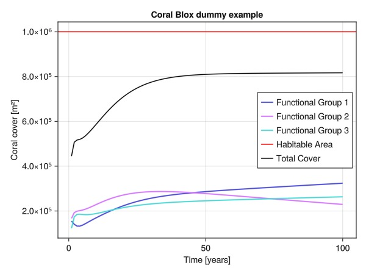

# CoralBlox.jl
[](https://doi.org/10.5281/zenodo.13251118)

-----

CoralBlox is a coral growth and mortality model. It simulates distinct coral
`FunctionalGroups` indirectly competing for a limited space over time. The model does not
directly consider disturbances such as mortality caused by cyclone, CoTS or heat stress. It
also does not have representation of anthropogenic restoration and conservation activities
such as coral seeding or cloud brightening. Such considerations can be included by
perturbing model state and CoralBlox parameters between time steps.

In CoralBlox, the corals are grouped according to their approximate diameter, forming
`SizeClasses`. A `SizeClass` is defined by a diameter interval, so all corals whose diameter
lie within the same interval belong to the same `SizeClass`. Hence, at each timestep, coral
growth is represented by a displacement in the diameter space. For each functional group,
corals from distinct `SizeClasses` have distinct growth rates. Since all corals within the
same `SizeClass` and `FunctionalGroup` have the same growth rate, we can visualize the
growth as groups of corals moving on the diameter space in blocks. Further details about
how this growth and mortality are implemented can be found below.

## Quick Start

This plot was generated using the following script as an example of how CoralBlox can be used:



It is worth noting that in the example script below there are no environmental disturbances
and all parameters (initial coral cover, size classes bounds, linear extensions and
survival rates), together with the number of recruits per year, were mocked and adjusted to
generate the above plot.

Before running the model, one needs to instantiate an Array to hold the coral cover for each
timestep, `FunctionalGroup` and `SizeClass`, and a vector of `FunctionalGroup`s:

```julia
using CoralBlox: FunctionalGroup

n_timesteps::Int64 = 100
n_functional_groups::Int64 = 3
n_size_classes::Int64 = 4

# Coral cover cache
C_cover::Array{Float64, 3} = zeros(n_timesteps, n_functional_groups, n_size_classes)

# Habitable area is the maximum possible cover
habitable_area::Float64 = 1e6

# Each row contains SizeClass' bounds
size_class_bounds::Matrix{Float64} = [
    0 0.05 0.8 1.4 1.5;
    0 0.05 0.5 0.9 1.0;
    0 0.05 0.5 0.9 1.0
]

# Mock initial coral cover
C_cover[1, :, :] = [
    0.08 0.05 0.02 0.005;
    0.07 0.06 0.03 0.007;
    0.05 0.05 0.02 0.003
] .* habitable_area

# Create functional groups
functional_groups::Vector{FunctionalGroup} = FunctionalGroup.(
    eachrow(size_class_bounds[:, 1:end-1]),      # lower bounds
    eachrow(size_class_bounds[:, 2:end]),        # upper bounds
    eachrow(C_cover[1, :, :])                # initial coral covers
)
```

In order to run a single timestep, a vector of recruits (representing young corals
entering the system) and matrices containing growth and survival rates for each
`FunctionalGroup` and `SizeClass` is needed:

```julia
using CoralBlox: linear_extension_scale_factors, max_projected_cover,
using CoralBlox: timestep!, coral_cover

# Mock linear extensions
linear_extensions::Matrix{Float64} = [
    0.004 0.025 0.1 0.0;
    0.003 0.007 0.005 0.0;
    0.002 0.004 0.01 0.0
]

# Mock survival rate
survival_rate::Matrix{Float64} = [
    0.5 0.6 0.65 0.8;
    0.6 0.7 0.8 0.8;
    0.5 0.8 0.8 0.8
]

# Caclulate maximum projected cover
habitable_max_projected_cover = max_projected_cover(
    linear_extensions,
    size_class_bounds,
    habitable_area
)

# Only apply linear extension scale factor when cover is above the scale_threshold
scale_threshold = 0.9 * habitable_area

# Linear extension scale factor
local lin_ext_scale_factors::Float64

for tstep::Int64 in 2:n_timesteps
    # Only re-scale if total cover is above a given threshold
    lin_ext_scale_factors = if sum(C_cover[tstep-1, :, :]) < scale_threshold
        1
    else
        linear_extension_scale_factors(
            C_cover[tstep-1, :, :],
            habitable_area,
            linear_extensions,
            size_class_bounds,
            habitable_max_projected_cover,
        )
    end

    # Use scale factor to calculate growth rate
    growth_rate::Matrix{Float64} = linear_extensions .* lin_ext_scale_factors

    # Mock recruits proportional to each functional group's cover and available space
    available_space::Float64 = habitable_area - sum(C_cover[tstep-1, :, :])
    available_proportion::Float64 = available_space / habitable_area
    adults_cover::Vector{Float64} = dropdims(sum(C_cover[tstep-1, :, 2:end], dims=2), dims=2)

    recruits_weights::Vector{Float64} = [0.6, 0.9, 1.5]
    availability_weight::Float64 = log(2.5, 1.5 + available_proportion)
    recruits::Vector{Float64} = adults_cover .* recruits_weights .* availability_weight

    # Perform timestep
    timestep!(
        functional_groups,
        recruits,
        growth_rate,
        survival_rate
    )

    # Write to the cover matrix
    coral_cover(functional_groups, @view(C_cover[tstep, :, :]))
end
```

The `lin_ext_scale_factors` calculated at each timestep prevents the corals from outgrowing
the habitable area, taking into account the simultaneous growth across all functional groups
and size classes. Details about how this scale factor is calculated and used can be
found below.

Consideration of external factors that may influence coral growth and mortality
could be included outside of each `timestep!` call, potentially informed by a broader
ecosystem model.

## Model details

Consider the area of each colony approximated by the area of a circumference with diameter
$x$:

$$
\begin{equation}
    a(x) = \frac{\pi x^2}{4}
\end{equation}
$$

Hence, given a diameter density function $\lambda(x)$ that represents the number of corals
with diameter $x$, the area $C(x_i,x_f)$ covered by corals with diameter between $x_i$ and
$x_f$ is given by the integral:

$$
\begin{equation}
    C(x_i,x_f) = \int_{x_i}^{x_f} \lambda(x) \frac{\pi x^2}{4} dx
\end{equation}
$$

In practice, we work with groups of coral with a constant diameter density over a certain
diameter interval, that we call `CoralBlock`. Each `CoralBlock` is characterized by a
constant diameter density $\lambda_{\tau\sigma b}$ (the block's height) and a diameter
interval $[\delta_{\tau\sigma b}^-, \delta_{\tau\sigma b}^+]$, with size
$\Delta \delta_{\tau\sigma b} = \delta_{\tau\sigma b}^+ - \delta_{\tau\sigma b}^-$ (the
block's width). The indices $\tau\sigma b$ refer to the $b$-th block from functional group
$\tau$ and size class $\sigma$. Therefore, the area covered by the corals within a coral
block $\tau\sigma b$ is given by:

$$
\begin{equation}
    C_{\tau\sigma b} = \lambda_{\tau\sigma b} \frac{\pi}{12} ((\delta_{\tau\sigma b}^+)^3 - (\delta_{\tau\sigma b}^-)^3)
\end{equation}
$$

The following sections explain in more detail how growth and mortality are represented.

### How does mortality work?

At each timestep $t$, before the growth event, we apply a survival rate to each
`CoralBlock`. That is done by multiplying each `FunctionalGroup` and `SizeClass` survival
rate $(1 - m_{\tau\sigma})$ by each `CoralBlock` diameter density
$\lambda_{\tau\sigma b; t}$, so that:

$$
\begin{equation}
    \lambda_{\tau\sigma b; t} = \lambda_{\tau\sigma b; t-1} (1 - m_{\tau\sigma})
\end{equation}
$$

### How does growth work?

For each `FunctionalGroup`, we can think of a horizontal axis representing the diameter
space with its `CoralBlock`s lined up. Then, a growth event is conceived as the displacement
of each block in this axis by a factor $\omega_{\tau\sigma;t}$, called growth rate, constant
for each `FunctionalGroup` $\tau$ and `SizeClass` $\sigma$. $\omega_{\tau\sigma;t}$ is
always smaller than the correspondent `SizeClass` width
$\Delta d_{\tau\sigma}=d_{\tau\sigma}^+-d_{\tau\sigma}^-$.

After a growth event we can have one of the three following situations: (1) the entire block
remains in size class $\sigma$; (2) the entire block has moved to size class $\sigma+1$; (3)
part of the block remains in size class $\sigma$ and part has moved to size class
$\sigma+1$. In the last case, we break the block in two new blocks, each belonging to only
a single size class.

In (1), the `CoralBlock` doesn't cross the frontier between `SizeClass`es. In this case,
its movement is constant. In (2) and (3), as soon as part of the block enters the next
`SizeClass`, the two parts move with different speeds (one can think of an analogy with a
mass of water flowing between two pipes with distinct diameters).

<!-- TODO

The paper will have a section with more details about this movement in the frontier between two SizeClasses. When this is done we can eiher copy/paste that here or put a link here to that section of the paper.

TODO -->

### How does the linear extension scale factor work?

Each coral colony has a base growth $l_{\tau\sigma}$, which is an increase in diameter.
This is referred to as the *linear extension* and depends on the colony's `FunctionalGroup`
and `SizeClass`. As the available space gets more populated, we assume that growth is
negatively affected, since there is a competition for resources. Even more, when there's no
available space left, we want the growth to be zero. To account for that, at each time step
we multiply all linear extensions by the same scale factor $\gamma_t$. This factor takes
into account not only the leftover space, but also the competition between different
`FunctionalGroup`s.

First we calculate a *projected cover* $C^P_t$, assuming no space limitation nor
competition, using the linear extensions directly as growth rates. We also calculate an
upper bound for the projected cover, called *maximum projected cover* $C^*$ assuming all
corals are in the last `SizeClass` of the `FunctionalGroup` with the highest linear
extension, and they growth freely. Two important notes here. First, there are infinite
possible upper bounds and, although the choice will affect the final scale factor, this
shouldn't change the final result drastically. Second, to prevent having to run a whole
timestep twice, for this *projected cover* (and other calculations related to the scale
factor) we instead use a simplified version of the model where each block moves by with a
constant velocity, even when changing `SizeClass`es.

Next, we calculate an *adjusted projected cover* $C^A_t$:

$$
\begin{equation}
    C^A_t = C_{t-1} + \frac{C^P_{t} - C_{t-1}}{C^*-C_{t-1}}\left(H - C_{t-1}\right)
\end{equation}
$$

Where $H$ is the habitable area, and $C_{t-1}$ is the cover on the previous timestep.
One can easily see that if $C^P_{t} = C^*$, we have $C^A_t = H$. In other words, in the
worst case, the *adjusted projected cover* is equals the habitable area. For all other
values of $C^P_t$, we have $C^A_t < H$, which means that the *adjusted projected cover* will
never outgrow the habitable area.

Lastly, we find the scale factor $\gamma_t$ that makes the *projected cover* equal to the
*adjusted projected cover*, assuming each `CoverBlock` growth rate is given by
$l_{\tau\sigma} \gamma_t$ and the sum of all `CoverBlocks`. The actual growth rate
used to run a timestep $t$ is given by:

$$
\begin{equation}
\omega_{\tau\sigma;t} = l_{\tau\sigma} \gamma_t
\end{equation}
$$
